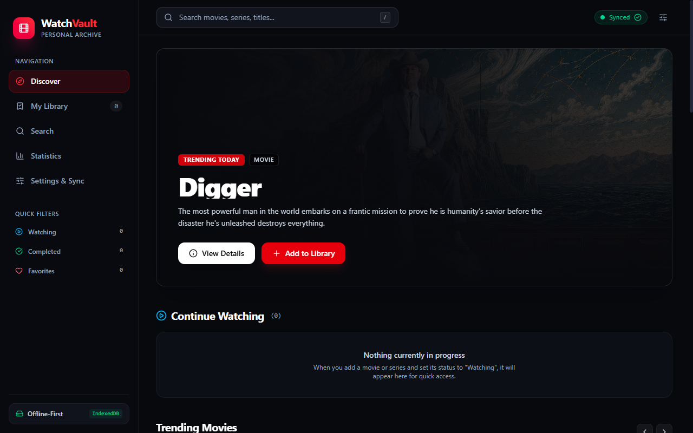
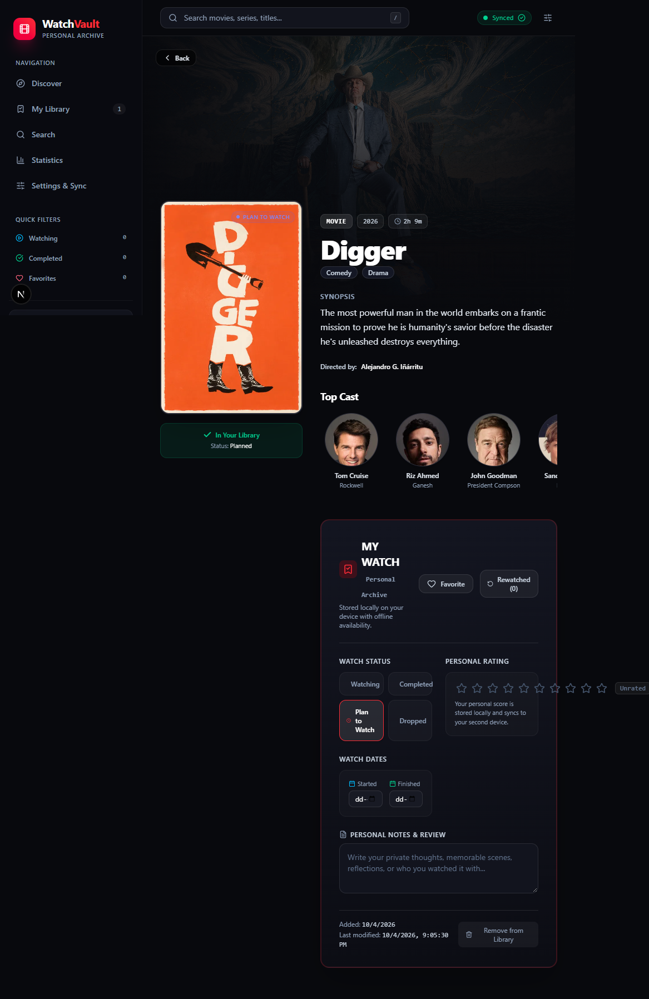
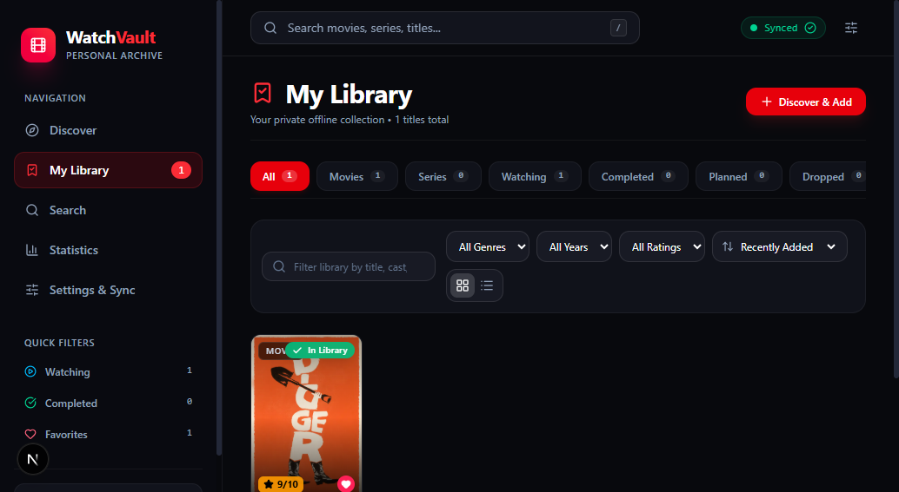
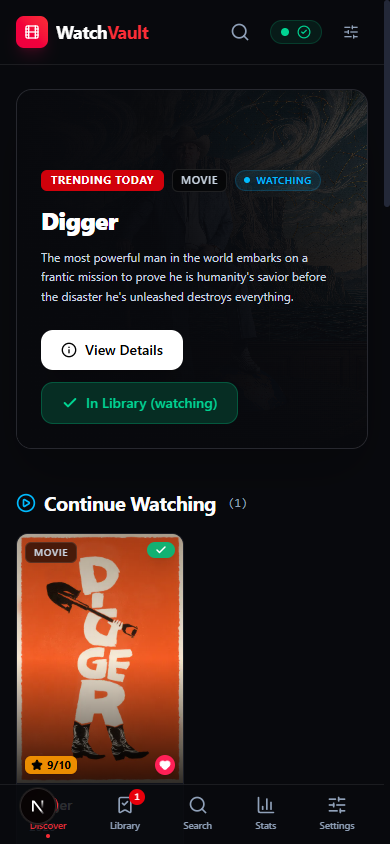

# WatchVault — Personal Movie & TV Vault

**WatchVault** is a private personal movie and TV/web-series archive featuring a Netflix-like discovery experience, Letterboxd-like personal tracking, offline-first local storage, and synchronization between desktop and mobile devices.

---

## 🌟 Key Features

### 1. Zero Mock Data & Authentic Personal Vault
- Launches with an empty library (`0` movies, `0` series, `0` watched, `0` favorites).
- All statistics, metrics, and progress are calculated strictly from your authentic IndexedDB collection.
- Elegant, encouraging empty states guide you to discover and add titles.

### 2. Clear Separation: Discovery vs. Personal Archive
- **Discovery Content**: Powered by The Movie Database (TMDB). Explore real trending movies, trending TV series, popular releases, and instant debounced search.
- **Personal Library**: A title becomes part of your library only when you click **"Add to Library"**.
- Titles already in your vault clearly display **"✓ In Library"** with your personal status and rating badges.

### 3. Offline-First Architecture (Dexie & IndexedDB)
- **Primary source of truth**: Local IndexedDB database managed via Dexie.js.
- Fully usable without internet:
  - Browse and filter your library.
  - Search offline library and cached metadata.
  - Edit ratings, watch statuses, notes, and dates.
  - Track TV season and episode progress.
  - Calculate real statistics and view cached title details.

### 4. Two-Device Synchronization & Conflict Resolution
- Synchronizes your desktop browser/PWA with your Android phone/PWA.
- **Outbox Pattern**: Local changes are written to IndexedDB immediately, then queued to `sync_queue`.
- **Conflict Resolution**: Timestamp-based field-level last-write-wins (LWW) with divergent notes preserved in local conflict history.
- Soft-deletion tombstones (`is_deleted: true`) ensure deletions synchronize across devices without data resurrection.

### 5. Detailed Personal Tracking ("MY WATCH")
- Watch statuses: `Plan to Watch`, `Watching`, `Completed`, `Dropped`.
- Independent `Favorite` heart toggle.
- 10-star rating system with real-time score pills.
- Start and finish date pickers.
- TV Series season/episode counters with interactive episode checklist.
- Private notes & reviews with auto-save.
- Rewatch counter.

### 6. PWA & Mobile Optimized
- Web App Manifest and Service Worker for offline app shell caching.
- Installable on desktop (Chrome/Edge) and Android.
- Desktop layout: Sidebar navigation with live count badges and top header.
- Mobile layout: Native bottom navigation bar with safe-area support.

---

## 📸 Screenshots & Interface Previews

| Desktop Discovery & First Launch | Title Details & "MY WATCH" Center |
| :---: | :---: |
|  |  |

| My Library (Grid & Filters) | Android / Mobile Navigation & PWA |
| :---: | :---: |
|  |  |

---

## 🚀 Getting Started

### Prerequisites
- Node.js 18+ (tested on Node v24)
- npm 9+

### Installation & Run
```bash
# Install dependencies
npm install

# Start development server
npm run dev

# Or build for production
npm run build
npm start
```
The app will be available at `http://localhost:3000` (or `http://localhost:3005`).

---

## ⚙️ Configuration & Environment Variables

Create a `.env.local` file in the project root:

```env
# Optional: Provide your own TMDB API v3 Key (a default working fallback is included)
TMDB_API_KEY=your_tmdb_api_key_here
```

*Note: You can also configure or update your custom TMDB API key directly inside the app under **Settings & Sync**.*

---

## 📁 Project Architecture

```
src/
├── app/
│   ├── api/
│   │   ├── sync/
│   │   │   ├── push/route.ts      # Push local outbox changes to sync server
│   │   │   └── pull/route.ts      # Pull remote changes since last sync
│   │   └── tmdb/
│   │       └── [...route]/route.ts# TMDB API proxy with caching
│   ├── library/
│   │   └── page.tsx               # Dedicated My Library page (tabs, filters, sort)
│   ├── title/
│   │   └── [mediaType]/[id]/      # Cinematic Title Details & "MY WATCH" Section
│   ├── search/
│   │   └── page.tsx               # Global multi-search with debouncing
│   ├── stats/
│   │   └── page.tsx               # Statistics strictly computed from IndexedDB
│   ├── settings/
│   │   └── page.tsx               # Sync status, storage stats, JSON import/export
│   ├── layout.tsx                 # Root layout with PWA meta & AppShell
│   └── page.tsx                   # Cinematic discovery homepage
├── components/
│   ├── layout/                    # Sidebar, MobileNav, TopHeader, SyncBadge
│   ├── media/                     # MediaCard, MediaRow, HeroBanner, StatusBadge
│   ├── library/                   # LibraryItemRow, EmptyState
│   └── details/                   # PersonalWatchSection, StarRating, EpisodeTracker, CastCarousel
├── hooks/
│   ├── useLibrary.ts              # Live Dexie query hook for reactive updates
│   ├── useSync.ts                 # Reactive sync engine state & trigger
│   ├── useNetworkStatus.ts        # Online/offline detection
│   └── useDebounce.ts             # Input debouncing hook
└── lib/
    ├── db/
    │   └── index.ts               # Dexie IndexedDB database & sync outbox
    ├── metadata/
    │   └── tmdb.ts                # TMDB service with Dexie caching
    ├── sync/
    │   ├── serverStore.ts         # Server sync store with conflict resolution
    │   └── syncEngine.ts          # Client sync engine & conflict handler
    └── types/
        └── index.ts               # Core TypeScript models
```
